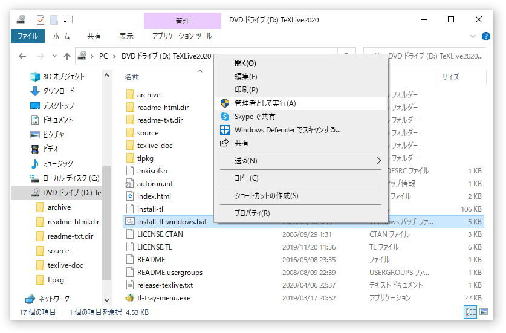
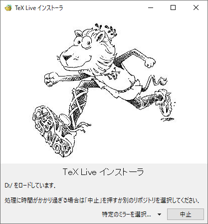
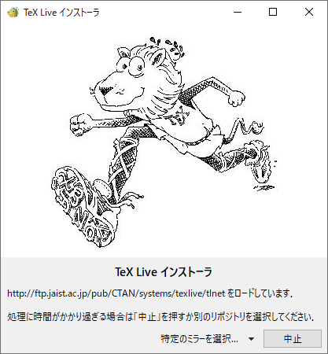
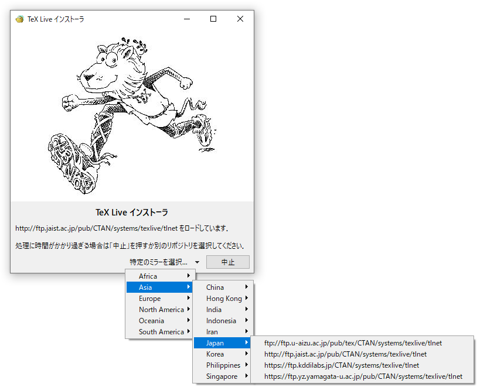
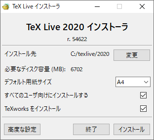
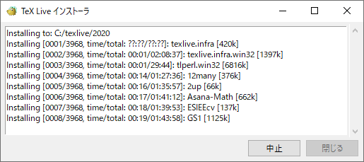
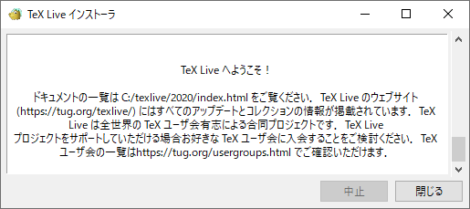

# Windows での TeX Live のインストールと設定

ここでは Windows (win32) に TeX Live 2020 をインストールする方法を説明します。

## インストーラーの取得

まず，インストーラーをダウンロードします。TeX Live のインストーラーは ISO イメージとネットインストーラーの2種類が提供されています。

- ISO イメージはリリース時点での各種パッケージも全て含めた DVD のイメージで，そのファイルサイズは3GBを超えます。
- ネットインストーラーはインストーラー本体のみなのでファイルサイズは23MBほどであり，その時点での最新のパッケージを必要に応じてダウンロードしてくれます。公式に推奨されている方法です。

この説明だけを読むとネットインストーラーを使えばよいように思われますが，残念なことにネットインストーラーを使うと環境によっては途中でパッケージのダウンロードに失敗して終了してしまうことがあります。さらに悪いことに，ネットインストールにはそれなりに時間がかかるのに対し，途中終了した場合にはそこから再開することができず，最初からやり直しになってしまいます。ネットワーク環境に問題がない限りは最初から ISO イメージをダウンロードしてしまった方が無難です。

### ISO イメージを使う場合

ISO イメージをお近くのミラーからダウンロードします。例えば CTAN のミラー

- http://mirror.ctan.org/systems/texlive/Images/texlive2020.iso

から入手できます。

次に，ダウンロードした ISO イメージをマウントします。Windows 8/8.1/10 では，OS の標準機能で可能ですが，Windows 7 では Virtual CloneDrive などのツールが必要です。

### ネットインストーラーを使う場合

インストーラをダウンロードして展開します。OS の標準機能で展開可能な ZIP 形式が無難でしょう。

- http://mirror.ctan.org/systems/texlive/tlnet/install-tl.zip

これを適当な作業ディレクトリで展開します。

## インストール

install-tl-windows.bat を右クリックし，「管理者として実行 (A)」を選択してインストーラーを起動します。

ISO イメージを使った場合は以下の画面が出るので，そのまま待ちます。

ネットインストーラの場合は以下の画面が出て，自動的に適したミラーサイトが選択されるので，そのまま待ちます。

もし自動的に選択されたミラーサイトではうまくいかないなら，「特定のミラーを選択」をクリックしてミラーサイトを自分で選択することができます。

インストーラの画面が出てきたら，「インストール」をクリックします。インストーラの画面と一緒に黒い画面（コマンドプロンプト）が出てくることがありますが，インストーラの画面だけを操作します。

待ちます。ISO イメージの場合は 30 分から長くても 2 時間，ネットワークインストールの場合はダウンロード速度にもよりますが，1 時間 30 分から 3 時間以上かかることもあります。

「TeX Live へようこそ！」と表示されたら完了です。「閉じる」をクリックします。「管理者として実行 (A)」した場合は，自動的にシステム環境変数の PATH（全ユーザ向け）に，一般ユーザで実行した場合はユーザ環境変数の PATH に `c:\texlive\2020\bin\win32` が追加されます。

最後に，ISO イメージからインストールした場合はアンマウントします。
